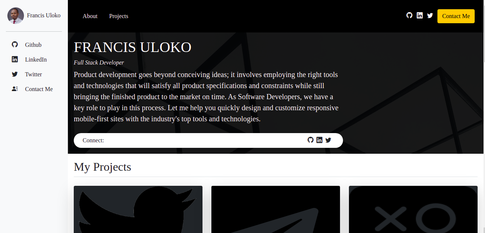

# My Software Development Portfolio

> I'm a Full Stack Developer, check out my porfolio!

## Screenshots

## Live Site

[Go to my portfolio](https://francisuloko.github.io/my-portfolio/)

## Language

- JavaScript
- Ruby
- Python
- HMTL
- CSS

## Framework

- Ruby on Rails
- Bootstrap
- Sass
- Rspec

## Skills

- Pair Programming
- Remote Work
- Mentoring
- Linux

## Built With

- HTML and CSS
- Bootstrap v5.0
- git and github
- bootstrap icons

## Clone Repo

To get a local copy up and running follow these simple steps:

Open your terminal and run the following commands:

   - `git clone git@github.com:francisuloko/my-portfolio.git`

   - `cd my-portfolio`

Open up with Live Server
   
   - `Alt+L Alt+O`

## Prerequisites

- `browser`
- `vscode + liveserver`
- `git`

## Author

👤 **Francis Uloko**

- [GitHub](https://github.com/francisuloko)
- [Twitter](https://twitter.com/francisuloko)
- [LinkedIn](https://linkedin.com/in/francisuloko)

## 🤝 Contributing

Contributions, issues, and feature requests are welcome!

Feel free to check the [issues page](https://github.com/francisuloko/my-portfolio/issues).

## Show your support

Give a ⭐️ if you like this project!

## Acknowledgments

- Microverse Inc.

## 📝 License

This project is [MIT](https://mit-license.org/) licensed.
